\newpage

# Úvod

V této kapitole si předvedeme, jak lze ke skriptu, využívajícímu nástroje ArcGIS Pro, vytvořit uživatelské rozhraní tak, aby nástroj vypadal a choval se podobně jako ostatní vestavěné nástroje v ArcGIS Toolbox. Jde o podobnou věc, jakou již znáte z vytváření uživatelského rozhraní k modelům z Model Builderu (viz kapitolu 1).

Po absolvování lekce budete umět:

-   Vytvářet vlastní nástroje s grafickým rozhraním v ArcGIS Pro
-   Nastavovat parametry nástrojů včetně datových typů a filtrů
-   Propojovat Python skripty s uživatelským rozhraním
-   Používat vytvořené nástroje v Pythonu i Model Builderu
-   Vytvářet zprávy o průběhu výpočtu
-   Pracovat s vícenásobnými a výstupními parametry
-   Implementovat závislé parametry
-   Vytvářet dokumentaci a nápovědu k nástrojům

:::{.callout-important}
## Důležité upozornění

Tvorba uživatelského rozhraní má dvě části:

1.  **Příprava grafického rozhraní** v ArcGIS Pro (přes Catalog)
2.  **Úprava skriptu** pro komunikaci s rozhraním (pomocí `arcpy.GetParameterAsText()`)

Obě části musí být správně propojeny, aby nástroj fungoval!
:::

## Data

V lekci budeme pracovat s daty, která již znáte z předchozích kapitol. Připravte si:

-   Vektorové vrstvy pro ořezávání (složka [`Liberec`](https://czuvpraze-my.sharepoint.com/:f:/g/personal/bartakv_fzp_czu_cz/IgBeRZqQbZmlT7m4T1eR2ZVhAaa5kkrM9uij0p5xkUQrmsU?e=dvVDaP))
-   Shapefily krajů `Kraje.shp` (složka [`Kraje_sidla`](https://czuvpraze-my.sharepoint.com/:f:/g/personal/bartakv_fzp_czu_cz/IgA7YzyaYppnSrjrIsXsOrYDAYsx-8a8ZalAuYh5bamICFo?e=PSFTQc))
-   Bodové vrstvy sídel `Sidla_body.shp` (složka [`Kraje_sidla`](https://czuvpraze-my.sharepoint.com/:f:/g/personal/bartakv_fzp_czu_cz/IgA7YzyaYppnSrjrIsXsOrYDAYsx-8a8ZalAuYh5bamICFo?e=PSFTQc))

# Tvorba jednoduchého nástroje

Tvorbu nástroje si předvedeme na jednoduchém příkladu nástroje BatchClip, který zadanou ořezovou polygonovou vrstvou ořeže všechny datasety ze zadané složky a ořezané vrstvy uloží do výstupní složky. Příslušný skript může vypadat např. takto:

```python
import arcpy
import os

# Vstupní parametry
input_folder = r"C:\data\vstup"
clip_feature = r"C:\data\clip_polygon.shp"
output_folder = r"C:\data\vystup"

# Nastavení prostředí
arcpy.env.workspace = input_folder

# Získání seznamu všech featureclass
feature_classes = arcpy.ListFeatureClasses()

# Ořezání všech vrstev
for fc in feature_classes:
    output_name = os.path.join(output_folder, fc)
    arcpy.analysis.Clip(fc, clip_feature, output_name)
    print(f"Ořezáno: {fc}")

print("Hotovo!")
```

Vytvořit ke skriptu uživatelské rozhraní znamená zajistit, aby vstupní parametry výpočtu (uvedeny schválně na začátku skriptu v samostatné sekci Vstupní parametry) mohl před spuštěním zadávat uživatel v nějakém přívětivém grafickém rozhraní. Jeho tvorba má dvě části: (1) příprava samotného grafického rozhraní a (2) úprava skriptu tak, aby s tímto rozhraním komunikoval.

## Vytvoření Toolboxu

Tvorba grafického rozhraní začíná v okně Catalog programu ArcGIS Pro. Nástroj - podobně jako v případě Model Builderu - musí existovat v nějakém toolboxu. Pokud tedy žádný připravený nemáte, je třeba jej nyní vytvořit: klikněte pravým tlačítkem myši na příslušnou složku v okně Catalog a zvolte **New -> Toolbox (.atbx)**.

:::{.callout-note}
## Toolbox a organizace nástrojů

V jednom toolboxu můžeme mít uloženo více nástrojů. Pokud tedy již vhodný toolbox máte, je možné tento krok přeskočit. Toolboxy jsou vhodné pro organizaci podobných nástrojů nebo nástrojů pro konkrétní projekt.
:::

## Přidání nového nástroje

Po vytvoření toolboxu do něj přidáme nový nástroj pomocí kliknutí na něj pravým tlačítkem myši a volbou **New -> Script**. Otevře se dialogové okno New Script na záložce General, kde je třeba zadat:

-   **Name**: název nástroje (bez mezer, používá se interně)
-   **Label**: název, pod kterým se bude nástroj zobrazovat v Toolboxu
-   **Description**: popis, co nástroj dělá (nepovinné)
-   **Summary**: stručné shrnutí toho, jak se používá (nepovinné)
-   **Illustration**: obrázek s grafickým znázorněním funkce nástroje (nepovinné)
-   **Icon**: ikona nástroje (nepovinné)

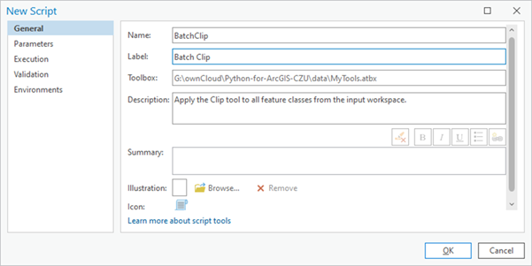

:::{.callout-tip}
## Struktura názvu

Doporučuje se používat:

-   **Name**: `BatchClip` (bez mezer, CamelCase)
-   **Label**: `Batch Clip` (čitelný název s mezerami)
:::

Po vyplnění názvu nástroje můžeme buď pokračovat na dalších záložkách, nebo potvrdit vytvoření nástroje kliknutím na "OK". V druhém případě pokračujeme na stejných záložkách v okně Tool Properties, které otevřeme kliknutím pravým tlačítkem myši na nástroj v okně Catalog a volbou **Properties**.

## Nastavení parametrů

Na záložce **Parameters** je třeba vyplnit parametry nástroje, které budou součástí uživatelského rozhraní. Každému parametru je přitom třeba zadat:

-   **Label**: název, pod jakým se bude zobrazovat v okně nástroje
-   **Name**: skutečný název, pod kterým se bude s parametrem zacházet např. při volání nástroje v Pythonu. Název se vygeneruje automaticky po zadání Labelu.
-   **Data Type**: datový typ parametru. Slouží k tomu, aby do příslušného parametru uživatel nemohl zadat nic nevhodného.
-   **Type**: zda se jedná o povinný parametr (Required) nebo nepovinný (Optional). U nepovinných parametrů je třeba zadat jejich defaultní hodnotu, takže uživatel není nucen se parametrem zabývat a pokud jeho hodnotu nenastaví, použije se tato defaultní.
-   **Direction**: zda se jedná o vstupní (Input), nebo výstupní (Output) parametr. Rozdíl je v tom, že při zadávání hodnoty výstupního parametru nemusí příslušný objekt (např. výstupní datová sada) existovat, neboť se předpokládá, že bude teprv vytvořen.

Náš nástroj má tři parametry: (1) složku se vstupními daty, (2) polygonovou vrstvu, kterou se mají data ořezávat, a (3) složku s výstupními daty. Hodnoty jejich vlastností vyplňte dle následujícího obrázku:

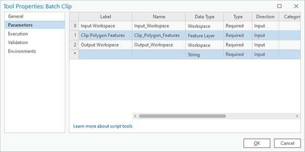

:::{.callout-note}
## Datový typ Workspace vs. Folder

Prvnímu a třetímu parametru jsme nastavili datový typ na **Workspace**. Alternativou by mohl být datový typ **Folder**, ten by nicméně neumožňoval zadat jako vstupní či výstupní složku geodatabázi.
:::

:::{.callout-note}
## Datový typ Feature Layer vs. Feature Class

Druhému parametru jsme nastavili datový typ na **Feature Layer**. Alternativami by mohly být datové typy **Feature Class** nebo **Shapefile**, ty by nicméně neumožňovaly vybírat při vyplňování hodnot parametru z vrstev aktuálně načtených do Contents a příslušnou třídu prvků (např. shapefile) by bylo vždy nutné vyhledat na disku.
:::

:::{.callout-warning}
## Směr parametru (Direction)

První i třetí parametr jsou (možná překvapivě) oba vstupní (**Input**). Přestože je totiž třetí parametr složkou pro výstupní ořezaná data, samotná složka již musí ve chvíli spouštění nástroje existovat a parametr je tedy vstupní.

Názvy výstupních datových sad se v našem skriptu generují automaticky z názvů vstupních dat a uživatel nad tím nemá kontrolu.
:::

## Nastavení filtru pro geometrii

Parametru Clip Polygon Features je také vhodné nastavit tzv. **filtr (Filter)**, který neumožní uživateli zadat jiný geometrický typ než polygon. Provedení je znázorněno na následujícím obrázku:

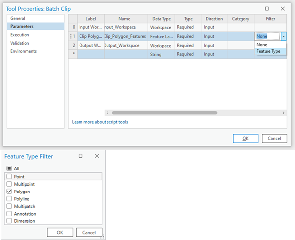

Po nastavení všech parametrů je možné nástroj standardním způsobem otevřít. Text napsaný do kolonky Description se zobrazuje jako rychlá nápověda po kliknutí na ikonu otazníku.

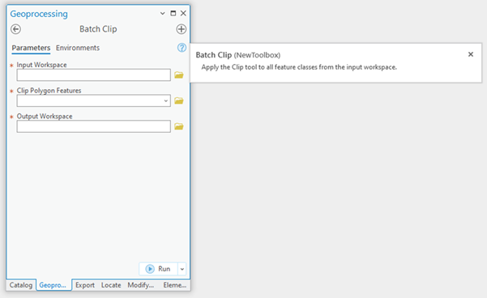

## Propojení skriptu s rozhraním

Před spuštěním nástroje je třeba zařídit, aby se hodnoty parametrů zadané uživatelem v grafickém rozhraní předaly do skriptu pro výpočet. K tomu slouží funkce **`GetParameterAsText`** z balíčku ArcPy. Při spuštění nástroje tato funkce přečte hodnotu z uživatelského rozhraní a vrátí jí v podobě textového řetězce. Jediným argumentem této funkce je **index** neboli pořadí parametru, který se má číst. Pořadí parametrů přitom odpovídá tomu, jak jsme je seřadili v grafickém rozhraní. Upravený skript bude vypadat takto:

```python
import arcpy
import os

# Vstupní parametry z GUI
input_folder = arcpy.GetParameterAsText(0)
clip_feature = arcpy.GetParameterAsText(1)
output_folder = arcpy.GetParameterAsText(2)

# Nastavení prostředí
arcpy.env.workspace = input_folder

# Získání seznamu všech featureclass
feature_classes = arcpy.ListFeatureClasses()

# Ořezání všech vrstev
for fc in feature_classes:
    output_name = os.path.join(output_folder, fc)
    arcpy.analysis.Clip(fc, clip_feature, output_name)
    print(f"Ořezáno: {fc}")

print("Hotovo!")
```

:::{.callout-important}
## Datový typ vrácený z GetParameterAsText

V našem případě jsou všechny parametry textové - jsou to adresy souborů a složek - proto jejich předání ve formě textu je to, co potřebujeme. Pokud bychom však chtěli např. zadávat v některých parametrech čísla či jiné datové typy, je nutné je po obdržení hodnoty parametru z funkce `GetParameterAsText` **zkonvertovat** na příslušný datový typ.

Alternativou by bylo použití funkce **`GetParameter`**, která provede konverzi automaticky. Nevýhodou je, že pak nemáme přímou kontrolu nad výsledným datový typem, v jakém funkce hodnotu předá.
:::

## Vložení skriptu do nástroje

Poslední věcí je propojení skriptu s uživatelským rozhraním. V něm je třeba zadat adresu skriptu v Tool Properties na záložce **Execution**. Výhodné je kliknout na ikonu **Embed script into tool**, což způsobí, že se kód skriptu napevno uloží do nástroje a není potom nutné spolu s nástrojem udržovat na příslušné adrese i samotný skript.

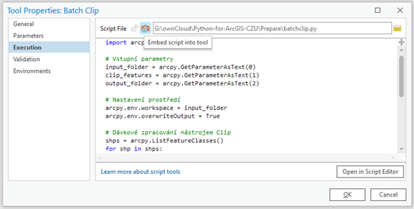

:::{.callout-warning}
## Editace vloženého skriptu

Pokud bychom chtěli v kódu dělat změny po vložení do nástroje, je pokaždé nutné skript znovu do nástroje nahrát. Během vývoje nástroje může být výhodnější ponechat skript jako samostatný soubor a vložit ho až po dokončení.
:::

Nyní již je nástroj hotový a připravený ke spuštění. Proveďte.

## Úlohy

**Úloha 9.1.** Vytvořte vlastní nástroj, který sečte dvě čísla zadaná uživatelem a výsledek vypíše pomocí `print()`. Použijte parametry typu **Long** (celé číslo) nebo **Double** (desetinné číslo). Nezapomeňte na konverzi z textu!

**Úloha 9.2.** Upravte nástroj BatchClip tak, aby uživatel mohl volitelně zadat prefix, který se přidá na začátek názvu všech výstupních souborů. Tento parametr by měl být nepovinný (Optional) s prázdnou výchozí hodnotou.

**Úloha 9.3.** Vytvořte nástroj, který spočítá počet prvků ve vrstvě a výsledek uloží do textového souboru. Nástroj by měl mít dva parametry: vstupní Feature Layer a výstupní Text File.

# Použití vytvořených nástrojů

Nástroje vytvořené výše popsaným způsobem lze používat stejně jako vestavěné nástroje z ArcGIS Toolboxu. Lze je např. přidávat do modelů v Model Builderu, nebo i volat v Pythonu. Druhou zmíněnou možnost si nyní ukážeme.

## Definování aliasu toolboxu

Podmínkou, aby mohly být nástroje z určitého toolboxu volány v Pythonu, je, aby příslušný toolbox měl definovaný **alias**, tj. jméno, pod kterým bude volán (ideálně nějaké krátké jméno bez mezer). Alias je možné definovat ve vlastnostech toolboxu (klik pravou myší na ikonu toolboxu v okně Catalog a volba **Properties**). Na následujícím obrázku je pro toolbox MyTools definován alias **mt**:

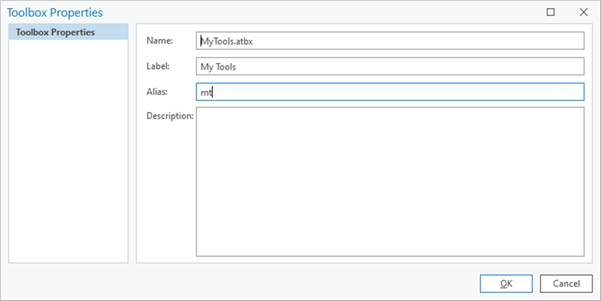

## Přidání toolboxu v Pythonu

Dále je nutné v Pythonu toolbox tzv. **přidat** pomocí funkce **`AddToolbox`**. Tím se z toolboxu vytvoří podmodul modulu ArcPy, přes který je možné jeho nástroje volat. Na výstupu se zobrazí název tohoto podmodulu, který je totožný s aliasem toolboxu:

```python
import arcpy

# Přidání toolboxu
arcpy.ImportToolbox(r"C:\cesta\k\MyTools.atbx")
```

Nástroj se pak volá přes tento podmodul, stejně jako se volají vestavěné nástroje ArcGIS:

```python
# Volání vlastního nástroje
result = arcpy.mt.BatchClip(
    r"C:\data\vstup",
    r"C:\data\clip.shp",
    r"C:\data\vystup"
)
```

:::{.callout-tip}
## Použití aliasu

Pokud máme toolbox s aliasem `mt`, nástroje z něj voláme jako `arcpy.mt.NazevNastroje()`. Alias funguje jako krátké "jméno" toolboxu, které usnadňuje práci v kódu.
:::

## Úlohy

**Úloha 9.4.** Vytvořte toolbox s aliasem `mytoolbox` a přidejte do něj nástroj z úlohy 9.1. Poté tento nástroj zavolejte z Pythonu a ověřte, že funguje.

**Úloha 9.5.** Vytvořte skript, který volá váš vlastní nástroj BatchClip v cyklu pro různé vstupní složky. Použijte seznam cest a pro každou cestu zavolejte nástroj.

# Zprávy o průběhu výpočtu

Při déle trvajících výpočtech, zvlášť pokud zahrnují cyklus, je výhodné mít nějakou představu o tom, jak výpočet probíhá a v jaké je fázi. Toho je možné docílit tím, že se na určitá místa v kódu vloží příkaz k vytištění nějaké zprávy. U skriptů spouštěných na konzoli je toto možné pomocí funkce `print`. U nástrojů ArcGIS plní odpovídající funkci funkce **`AddMessage`** z modulu ArcPy. Jejím jediným argumentem je textový řetězec zprávy, která se má vytisknout. Použití funkce `AddMessage` v rámci nástroje BatchClip je uvedeno v následujícím kódu:

```python
import arcpy
import os

# Vstupní parametry z GUI
input_folder = arcpy.GetParameterAsText(0)
clip_feature = arcpy.GetParameterAsText(1)
output_folder = arcpy.GetParameterAsText(2)

# Nastavení prostředí
arcpy.env.workspace = input_folder

# Získání seznamu všech featureclass
feature_classes = arcpy.ListFeatureClasses()

# Informační zpráva o počtu vrstev
arcpy.AddMessage(f"Nalezeno {len(feature_classes)} vrstev k ořezání")

# Ořezání všech vrstev
for i, fc in enumerate(feature_classes, 1):
    arcpy.AddMessage(f"Zpracovávám {i}/{len(feature_classes)}: {fc}")
    output_name = os.path.join(output_folder, fc)
    arcpy.analysis.Clip(fc, clip_feature, output_name)

arcpy.AddMessage("Všechny vrstvy byly úspěšně ořezány!")
```

Výpis zpráv se objevuje spolu s ostatními běhovými zprávami v záznamu běhu nástroje, který je dostupný např. po kliknutí na **View Details** v dolní části panelu Geoprocessing po skončení běhu nástroje.

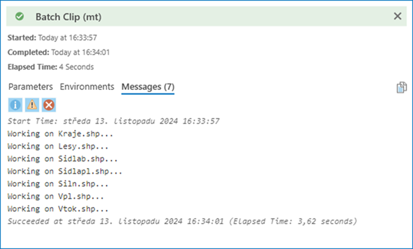

Zároveň je součásti objektu `Result`, který vrací nástroj, voláme-li ho jako funkci v Pythonu:

```python
result = arcpy.mt.BatchClip(input_folder, clip_feature, output_folder)

# Přístup ke zprávám
for msg in result.getMessages():
    print(msg)
```

:::{.callout-tip}
## Typy zpráv v ArcPy

ArcPy nabízí tři typy zpráv:

-   **`AddMessage()`**: Informační zprávy (modré)
-   **`AddWarning()`**: Varování (žluté)
-   **`AddError()`**: Chybové zprávy (červené)

Použití správného typu zprávy pomáhá uživateli rychleji identifikovat důležité informace nebo problémy.
:::

## Úlohy

**Úloha 9.6.** Upravte váš nástroj BatchClip tak, aby vypisoval zprávy o průběhu včetně časových údajů (čas začátku, čas konce každé operace). Použijte modul `datetime`.

**Úloha 9.7.** Vytvořte nástroj, který kontroluje, zda vstupní data existují před spuštěním výpočtu. Pokud neexistují, vypište chybovou zprávu pomocí `AddError()` a ukončete skript pomocí `sys.exit()`.

# Vícenásobné a výstupní parametry

Různých typů parametrů a jejich vlastností je velké množství. Některé z nich si ukážeme na příkladu dalšího nástroje, který má pro vstupní seznam vektorových vrstev udělat obalovanou zónu o zadaném poloměru. Obalové zóny vstupních vrstev by přitom měly být spojeny do jediné vrstvy, přičemž prostorově se nepřekrývající části by měly být v samostatných polygonech, naopak prostorově se překrývající části obalové zóny by měly být spojené do jediného polygonu.

Pokud bychom měli na vstupu bodovou, liniovou a polygonovou vrstvu jako na tomto obrázku:

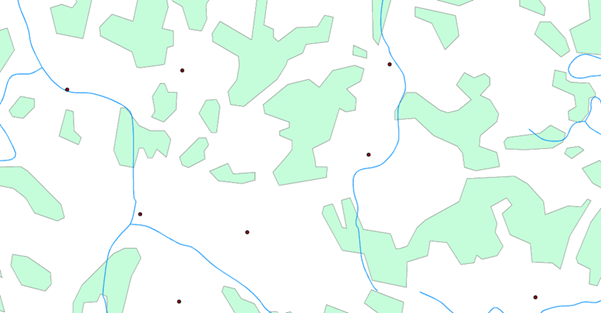

měla by výstupní vrstva vypadat nějak takto:

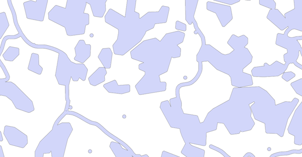

## Skript před vytvořením GUI

Skript, který by tuto úlohu zpracovával, by mohl vypadat nějak takto:

```python
import arcpy

# Vstupní parametry
feature_list = [
    r"C:\data\body.shp",
    r"C:\data\linie.shp",
    r"C:\data\polygony.shp"
]
buffer_distance = "100 Meters"
output_features = r"C:\data\joint_buffer.shp"

# Nastavení pracovního adresáře na paměť
arcpy.env.workspace = "memory"

# Vytvoření bufferů pro každou vrstvu
buffers = []
for fc in feature_list:
    buffer_name = "buffer_" + arcpy.Describe(fc).baseName
    buffer_result = arcpy.analysis.Buffer(fc, buffer_name, buffer_distance)
    buffers.append(buffer_result)

# Spojení všech bufferů
union_result = arcpy.analysis.Union(buffers, "union_result")

# Sloučení překrývajících se částí
arcpy.management.Dissolve(union_result, output_features, "", "", "SINGLE_PART")
```

:::{.callout-note}
## Pracovní adresář "memory"

Pracovní adresář byl na začátku nastaven na `"memory"`. Díky tomu se veškeré průběžné výstupy (tj. všechny výstupy z nástroje Buffer a výstup z nástroje Union) budou dočasně ukládat do operační paměti a nikoli na pevný disk. Pouze konečný výstup z nástroje Dissolve se uloží do umístění specifikovaného v proměnné `output_features`.

Práce v paměti je výrazně rychlejší, ale vyžaduje dostatek RAM.
:::

:::{.callout-note}
## Objekty Result jako vstupy

Seznam `buffers`, do kterého se ukládají výsledky jednotlivých obalových zón, obsahuje objekty `Result`. Ty je však možné použít jako vstupy do dalších analýz - ArcPy automaticky extrahuje cestu k výstupním datům.
:::

:::{.callout-note}
## Vícenásobný vstup jako seznam

V nástroji Union se vícenásobný vstup (seznam vrstev, které se mají spojit) zadává jako pythonovský seznam. Jaké jiné nástroje s vícenásobným vstupním parametrem znáte?
:::

:::{.callout-note}
## Nepovinné parametry v Dissolve

V nástroji Dissolve je parametr `multi_part` nastaven na hodnotu `"SINGLE_PART"` (viz nápovědu k tomuto nástroji!). Jelikož je tento parametr až pátý v řadě a předcházejí mu dva nepovinné parametry, u nichž chceme ponechat výchozí hodnoty, je na místě těchto parametrů prázdný řetězec `""`.
:::

Vyzkoušejte výše uvedený skript na datech ze složky Liberec.

## Vytvoření nástroje s vícenásobným parametrem

Nyní k nástroji vytvoříme uživatelské rozhraní. Postupujeme stejně jako v předchozím případě: vytvoříme v našem toolboxu nový skript a nastavíme mu název (např. "JointBuffer") a label (např. "Joint Buffer"). Dále otevřeme vlastnosti nového nástroje a vyplníme tabulku parametrů. Při volbě datového typu parametru **Input Features** přitom zaškrtneme volbu **Multiple values**. To pak v uživatelském rozhraní způsobí, že bude možné do parametru zadat více hodnot, tedy v tomto případě více vstupních vektorových vrstev.

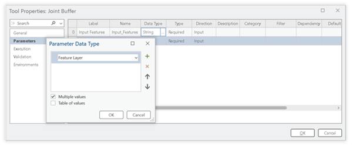

## Parametr vzdálenosti bufferu

Dalším parametrem je vzdálenost obalové zóny (**Buffer distance**). Na výběr máme dva různé datové typy:

-   **Double**: uživateli dovolí zadat libovolné číslo
-   **Linear Unit**: umožní zadat jednotky, ve kterých se má vzdálenost interpretovat (defaultně se použijí jednotky aktuálního souřadnicového systému mapy)

Třetím parametrem je název a umístění výstupní polygonové datové sady. Jelikož tato datová sada bude teprve v průběhu výpočtu vytvořena, je třeba tomuto parametru nastavit vlastnost **Direction** na **Output** - jde o tzv. **výstupní parametr**. Nastavení všech parametrů je znázorněno na následujícím obrázku:

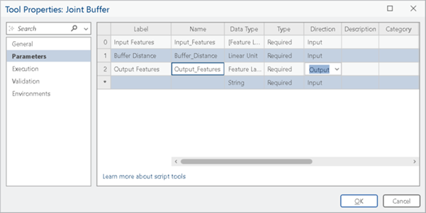

## Úprava skriptu pro GUI

Nyní stačí upravit hlavičku skriptu tak, aby se hodnoty vstupních parametrů načítaly z uživatelského rozhraní. V případě vícenásobného parametru Input Features je třeba mít na mysli, že vstupní vrstvy se pomocí funkce `GetParameterAsText` předají jako textový řetězec, kde budou jednotlivé hodnoty oddělené středníkem. Abychom z tohoto řetězce vytvořili seznam vstupních vrstev (resp. cest k nim), je třeba tento řetězec rozdělit metodou **`split`**, kde dělícím znakem je středník. Tuto metodu můžeme volat rovnou za voláním funkce `GetParameterAsText`, takže do proměnné `feature_list` se již rovnou uloží seznam řetězců namísto jednoho řetězce:

```python
import arcpy

# Vstupní parametry z GUI
feature_list = arcpy.GetParameterAsText(0).split(";")
buffer_distance = arcpy.GetParameterAsText(1)
output_features = arcpy.GetParameterAsText(2)

# Nastavení pracovního adresáře na paměť
arcpy.env.workspace = "memory"

# Vytvoření bufferů pro každou vrstvu
buffers = []
for fc in feature_list:
    buffer_name = "buffer_" + arcpy.Describe(fc).baseName
    buffer_result = arcpy.analysis.Buffer(fc, buffer_name, buffer_distance)
    buffers.append(buffer_result)
    arcpy.AddMessage(f"Buffer vytvořen pro: {fc}")

# Spojení všech bufferů
arcpy.AddMessage("Spojuji buffery...")
union_result = arcpy.analysis.Union(buffers, "union_result")

# Sloučení překrývajících se částí
arcpy.AddMessage("Provádím dissolve...")
arcpy.management.Dissolve(union_result, output_features, "", "", "SINGLE_PART")

arcpy.AddMessage("Joint buffer dokončen!")
```

:::{.callout-important}
## Parsing vícenásobných parametrů

Při čtení vícenásobného parametru pomocí `GetParameterAsText()` dostaneme:

-   **Jeden textový řetězec** s hodnotami oddělenými středníkem
-   Je nutné ho **rozdělit** pomocí `.split(";")`
-   Výsledkem je **seznam řetězců** se cestami k jednotlivým vrstvám

Například: `"C:\data\a.shp;C:\data\b.shp"` → `["C:\data\a.shp", "C:\data\b.shp"]`
:::

Spusťte vytvořený nástroj a použijte na datech ze složky Liberec.

## Úlohy

**Úloha 9.8.** Vytvořte nástroj, který přijme více Feature Layers a pro každý z nich vypočítá a vypíše celkovou plochu. Použijte vícenásobný parametr.

**Úloha 9.9.** Upravte nástroj Joint Buffer tak, aby výstupní Feature Class obsahovala atribut s informací o tom, kolik vstupních vrstev se v dané oblasti překrývalo.

**Úloha 9.10.** Vytvořte nástroj, který přijme seznam rastrů a provede jejich mozaikování do jednoho výstupního rastru. Použijte nástroj `MosaicToNewRaster`.

# Závislé parametry

Často je potřeba, aby určitý parameter nabízel uživateli ze seznamu daných hodnot, přičemž tento seznam není dopředu znám a závisí na tom, jak bude zadán nějaký jiný parametr. Typickým příkladem je, pokud má uživatel zadávat název nějakého pole (tj. atributu), přičemž seznam názvů polí by měl odpovídat reálným polím z nějaké vrstvy, kterou uživatel zadal do jiného parametru. V terminologii ArcGIS je název pole tzv. **závislým (dependent)** parametrem, neboť jeho hodnoty jsou závislé na hodnotě jiného parametru.

## Příklad: Převod vektoru na rastr

Věc si předvedeme na jednoduchém nástroji, který převede vstupní vektorovou vrstvu na rastr. Jak známo, při takové konverzi je nutné zadat nějaké pole vstupní vektorové vrstvy, které se použije pro přiřazení hodnot buňkám výstupního rastru. Je-li toto pole číselné, budou v buňkách příslušná čísla, je-li jiné než číselné, budou v buňkách celá čísla odpovídající unikátním hodnotám v zadaném poli. Skript nástroje, ještě bez uživatelského rozhraní, bude vypadat nějak takto:

```python
import arcpy

# Vstupní parametry
input_features = r"C:\data\lesy.shp"
conversion_field = "TYP_LESA"
output_raster = r"C:\data\lesy_raster.tif"
cell_size = 10

# Konverze vektoru na rastr
arcpy.conversion.FeatureToRaster(
    input_features,
    conversion_field,
    output_raster,
    cell_size
)

print("Konverze dokončena!")
```

## Propojení s GUI - základní verze

Pro propojení skriptu s uživatelským rozhraním musíme opět nahradit napevno napsané cesty k datům odkazy na vstupy z uživatelského rozhraní:

```python
import arcpy

# Vstupní parametry z GUI
input_features = arcpy.GetParameterAsText(0)
conversion_field = arcpy.GetParameterAsText(1)
output_raster = arcpy.GetParameterAsText(2)
cell_size = arcpy.GetParameterAsText(3)

# Konverze vektoru na rastr
arcpy.conversion.FeatureToRaster(
    input_features,
    conversion_field,
    output_raster,
    cell_size
)

arcpy.AddMessage("Konverze dokončena!")
```

## Nastavení závislosti v GUI

Při tvorbě samotného uživatelského rozhraní budeme postupovat stejně, jako v kapitole 9.1, tedy tvorbou nového nástroje (New Script) v toolboxu, ve kterém chceme nástroj mít, a definováním jeho parametrů. U parametru **Conversion Field** je třeba ve sloupci **Dependency** vybrat parametr, na kterém má být závislý, tj. v našem případě **Input Features**.

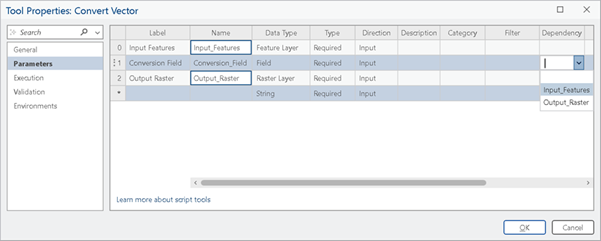

Tvorbu rozhraní se samozřejmě třeba dokončit vložením kódu skriptu do nástroje, jak bylo popsáno v kapitole 9.1.

## Výsledek v GUI

Při zadávání konkrétních hodnot parametrů v uživatelském rozhraní se nyní po zadání vstupní vektorové vrstvy u parametru Conversion Field zobrazí nabídka dostupných polí z této vrstvy. To zajistí, že si jednak uživatel nemusí názvy polí pamatovat, a druhak nemůže do parametru zadat nic nesmyslného (např. název neexistujícího pole).

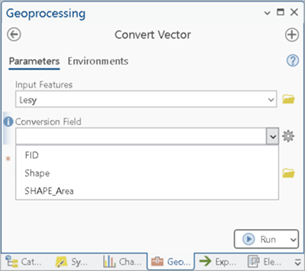

:::{.callout-note}
## Filtry pro typy polí

Pokud bychom chtěli omezit výběr možných polí např. jen na textová, numerická či jiná pole, je možné u parametru Conversion Field nastavit **filtr**. Použití filtrů bylo ukázáno v kapitole 9.1.
:::

:::{.callout-note}
## Smysl příkladu

Uvedený nástroj poněkud postrádá smysl, neboť obsahuje pouze volání jediného nástroje FeatureToRaster. Mohli bychom si proto vystačit s již vytvořeným uživatelským rozhraním tohoto nástroje. Příklad nicméně sloužil pro demonstraci použití závislých parametrů.
:::

Použijte nástroj na některé shapefily ze složky Liberec. Zjistěte, jak se bude výsledek lišit při použití různých polí pro parametr Conversion Field.

:::{.callout-tip}
## Otázka k zamyšlení

Jak byste postupovali, aby např. rastr reprezentující lesy měl pouze dvě hodnoty, jednu pro reprezentování lesů (např. hodnotu 1) a druhou pro ostatní plochy (např. hodnotu NoData či 0)?

*Nápověda: Použijte nástroj AddField a UpdateCursor k vytvoření binárního pole před konverzí.*
:::

## Úlohy

**Úloha 9.11.** Vytvořte nástroj, který spočítá statistiku (průměr, minimum, maximum) pro vybrané číselné pole ve Feature Class. Pole pro výpočet by mělo být závislé na vstupní vrstvě.

**Úloha 9.12.** Vytvořte nástroj pro výběr prvků podle hodnoty v atributu. Nástroj by měl mít tři parametry: vstupní vrstvu, pole (závislé na vrstvě) a hodnotu pro filtrování.

**Úloha 9.13.** Vytvořte nástroj, který vypočítá poměr dvou číselných polí a uloží výsledek do nového pole. Oba zdrojová pole by měla být závislé parametry s filtrem pro numerické typy.

# Tvorba nápovědy

K vytvořeným nástrojům je možné vytvořit nápovědu. Formulář pro vyplnění jednotlivých položek nápovědy lze otevřít pomocí kliknutí pravým tlačítkem myši na nástroj v toolboxu a volby **Edit Metadata**. Naopak prohlížet hotovou nápovědu lze pomocí **View Metadata**.

## Základní popis nástroje

Prvníinfí položkou nápovědy je základní popis funkcionality nástroje. Jediná povinnou položkou je **Tags**, kde se uvedou klíčová slova usnadňující vyhledávání nástroje. Důležitější jsou nicméně položky **Summary** a **Usage**:

-   **Summary**: stručný popis, co nástroj dělá
-   **Usage**: důležité detaily toho, jak se má nástroj správně spustit a jak se chová
-   **Illustration**: obrázek, který smysl nástroje znázorňuje

Příklad vyplnění těchto položek:

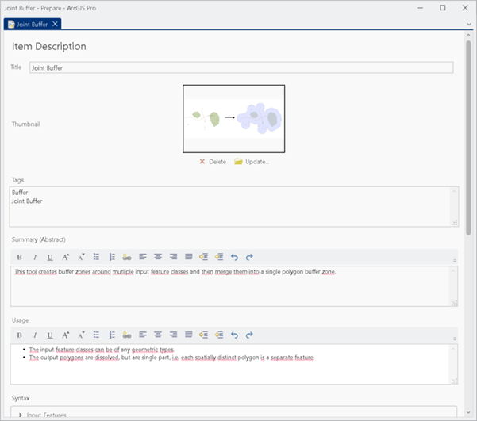

## Nápověda k parametrům (Syntax)

Následuje nápověda k jednotlivým parametrům (sekce **Syntax**). Zde se uvede ke každému parametru, co daný parametr znamená a jak se má správně vyplnit. Popis je rozdělen na dvě sekce:

-   **Dialog Explanation**: se týká situace, kdy je nástroj používán přes své dialogové okno v panelu Geoprocessing v ArcGIS Pro
-   **Scripting Explanation**: se naopak týká situace, kdy je nástroj volán pomocí Pythonu

Příklady pro parametr Input Features:

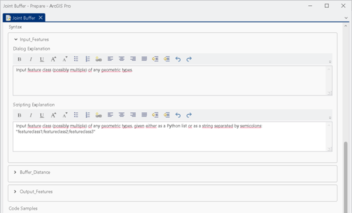

## Příklady kódu

Dále je možné uvést příklady použití nástroje v kódu psané v Pythonu, jak ukazuje následující ukázka. Pod touto sekcí je důležitá sekce **Credits**, kde je záhodno uvést údaje o autorech, místu a času vzniku nástroje a případném licenčním omezení jeho použití.

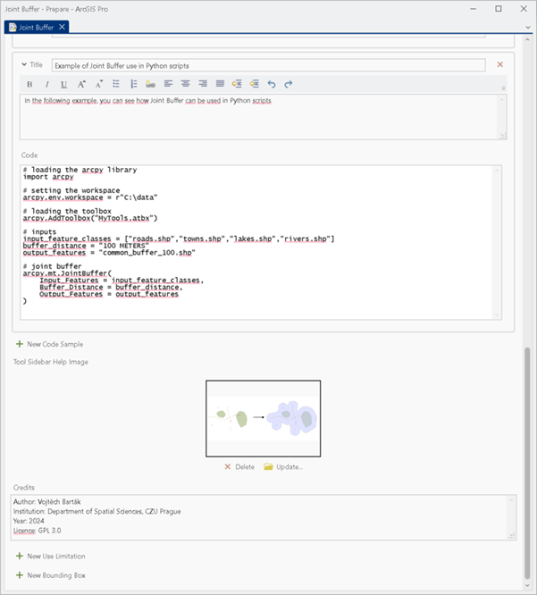

:::{.callout-tip}
## Dobře napsaná nápověda

Kvalitní nápověda by měla obsahovat:

1.  **Jasný popis** účelu nástroje
2.  **Příklady použití** v různých scénářích
3.  **Upozornění** na důležité omezení či požadavky
4.  **Příklady kódu** pro volání z Pythonu
5.  **Informace o autorech** a licenci

Inspirujte se nápovědou vestavěných nástrojů ArcGIS Pro!
:::

## Úlohy

**Úloha 9.14.** Vytvořte kompletní dokumentaci pro jeden z vašich nástrojů včetně Summary, Usage, popisu všech parametrů a příkladů kódu.

**Úloha 9.15.** Přidejte ke svému nástroji ilustrační obrázek, který vysvětluje jeho funkci. Můžete použít screenshot z ArcGIS Pro nebo vytvořit schéma.

# Shrnutí

V této lekci jsme se naučili:

-   **Vytvářet vlastní nástroje** s grafickým rozhraním v ArcGIS Pro
-   **Nastavovat různé typy parametrů** včetně povinných, nepovinných, vícenásobných a výstupních
-   **Propojovat Python skripty** s uživatelským rozhraním pomocí `GetParameterAsText()`
-   **Volat vytvořené nástroje** z Pythonu pomocí toolbox aliasů
-   **Vytvářet zprávy o průběhu** pomocí `AddMessage()`, `AddWarning()` a `AddError()`
-   **Pracovat s vícenásobnými parametry** a parsovat je pomocí `split()`
-   **Implementovat závislé parametry** (např. výběr pole závislý na vstupní vrstvě)
-   **Vytvářet dokumentaci** a nápovědu k nástrojům

:::{.callout-important}
## Klíčové koncepty

1.  **GetParameterAsText(index)**: Funkce pro čtení hodnot z GUI, vrací vždy text
2.  **Toolbox alias**: Krátké jméno toolboxu pro volání nástrojů v Pythonu
3.  **AddMessage()**: Funkce pro výpis zpráv viditelných v GUI i v Result objektu
4.  **Multiple values**: Parametr může přijmout více hodnot oddělených středníkem
5.  **Dependent parameters**: Parametr, jehož možné hodnoty závisí na jiném parametru
6.  **Direction (Input/Output)**: Určuje, zda parametr musí existovat před spuštěním
:::

# Užitečné odkazy

-   [ArcGIS Pro: Python toolboxes](https://pro.arcgis.com/en/pro-app/latest/arcpy/geoprocessing_and_python/a-quick-tour-of-python-toolboxes.htm)
-   [ArcGIS Pro: Script tool parameters](https://pro.arcgis.com/en/pro-app/latest/arcpy/geoprocessing_and_python/defining-parameters-in-a-python-toolbox.htm)
-   [ArcGIS Pro: Tool messages](https://pro.arcgis.com/en/pro-app/latest/arcpy/geoprocessing_and_python/returning-messages-from-a-script-tool.htm)
-   [ArcGIS Pro: GetParameterAsText](https://pro.arcgis.com/en/pro-app/latest/arcpy/functions/getparameterastext.htm)

---

